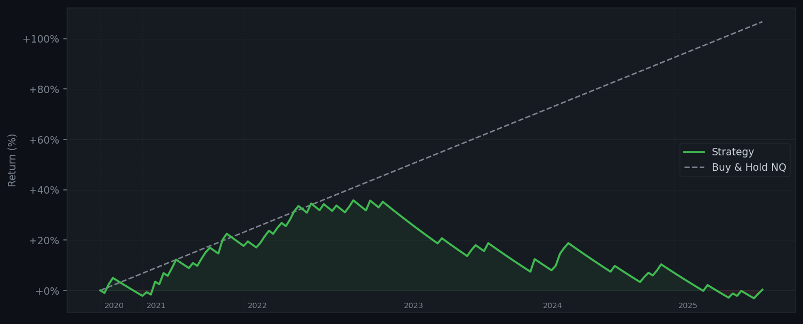
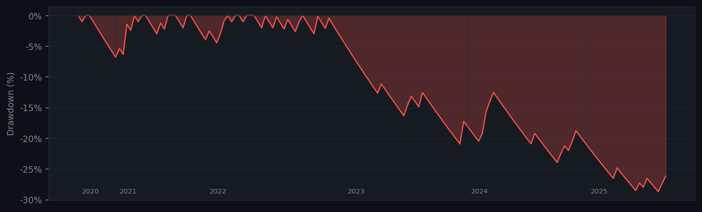
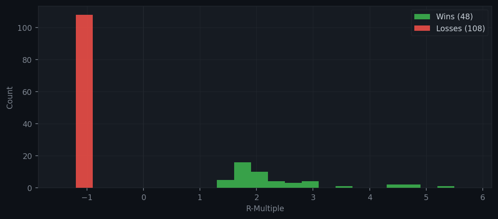
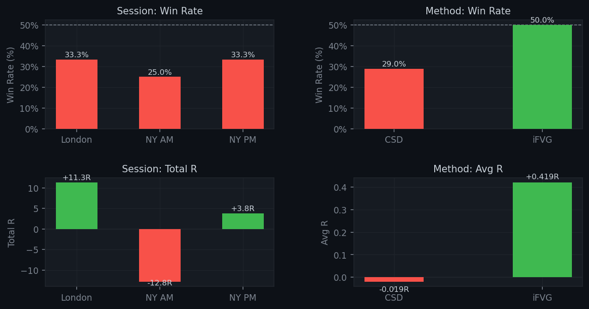

# ICC/CCT Strategy Backtest

Mechanical backtest of the **ICC + CCT (Candlestick Continuation Theory)** trading strategy, based on the Navi Trades YouTube series. The strategy combines displacement candles with virgin wick POIs to find high-probability scalp entries on NQ futures.

- **Timeframes**: 1H (setup) / 1M (entry)
- **Instruments**: NQ, Gold
- **Sessions**: London (02:00–05:00 EST), NY AM (09:30–12:00), NY PM (13:00–16:00)

## Backtest Results (NQ, 2020–2025)

### Equity Curve vs Buy & Hold



### Drawdown



### R-Multiple Distribution



### Session & Method Breakdown



## Strategy Overview

1. **Displacement candle** — Identify a strong 1H candle (≥1.3× ATR range, ≥70% body) that closes through a virgin wick
2. **POI** — The virgin wick tip becomes the point of interest for the next hour
3. **Engagement** — On 1M, wait for price to trade into the POI and reject
4. **Entry** — Via CSD (Change in State of Delivery) or iFVG (Inverse Fair Value Gap)
5. **Stop** — Exact wick extreme of the engagement move
6. **Target** — Nearest 1M/5M swing extreme (min 1.5R distance)

See [`strategy.md`](strategy.md) for the full mechanical specification.

## Project Structure

```
navi-trades/
├── backtest/
│   ├── data.py         # Data loading and 1H resampling
│   ├── indicators.py   # Wilder ATR calculation
│   ├── setup.py        # Displacement + virgin wick scanning
│   ├── entry.py        # CSD and iFVG entry logic
│   └── engine.py       # Trade execution and management
├── data/
│   └── nq_1m.parquet   # 1-minute NQ bar data (not tracked in git)
├── examples/           # Sample HTML reports
├── images/             # README chart images (generated)
├── transcipt/          # Source material (screenshots, SRT)
├── run_backtest.py     # CLI entry point
├── report.py           # Stats computation and HTML report generation
├── diagnose.py         # Diagnostic/debugging utilities
├── funnel_diag.py      # Setup funnel diagnostics
└── strategy.md         # Full strategy specification
```

## Usage

```bash
# Run with defaults (all sessions, NQ data)
python3 run_backtest.py

# Custom parameters
python3 run_backtest.py \
  --data data/nq_1m.parquet \
  --output report.html \
  --sessions london,ny_am,ny_pm \
  --atr-mult 1.3 \
  --body-pct 0.70 \
  --poi-lookback 10 \
  --min-rr 1.5

# Regenerate README charts
python3 generate_readme_charts.py
```

## Parameters

| Parameter | Default | Description |
|-----------|---------|-------------|
| `--data` | `data/nq_1m.parquet` | Path to 1M bar data |
| `--output` | `report.html` | Output report path |
| `--sessions` | `london,ny_am,ny_pm` | Sessions to trade |
| `--atr-mult` | `1.3` | Min displacement range as ATR multiple |
| `--body-pct` | `0.70` | Min body/range ratio for displacement |
| `--poi-lookback` | `10` | 1H bars to look back for virgin wicks |
| `--min-rr` | `1.5` | Minimum R:R for a valid TP target |

## Output

The HTML report (`report.html`) includes:
- Trade-by-trade log with entry/exit details
- Win rate, expectancy, profit factor
- Interactive equity curve vs. buy-and-hold (Plotly)
- Drawdown chart, R-distribution histogram
- Session and method breakdowns
- Monthly performance table

## Requirements

```bash
pip install pandas pyarrow matplotlib numpy
```

## Sources

https://youtu.be/4ibsyQIg7pc?si=7kM-squmzlBnj76e

